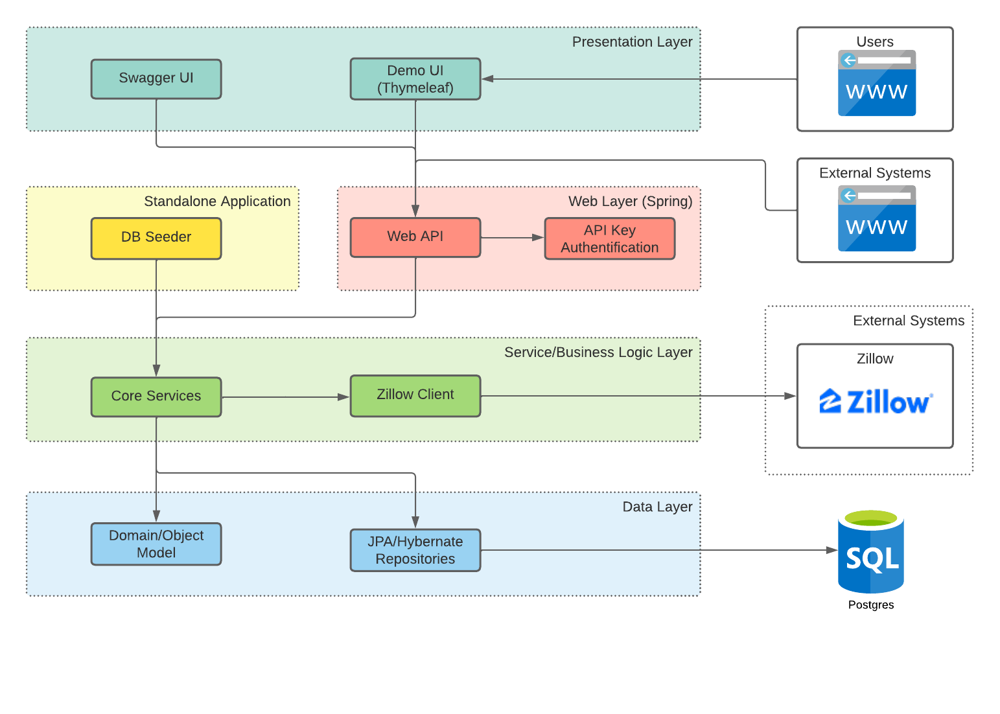
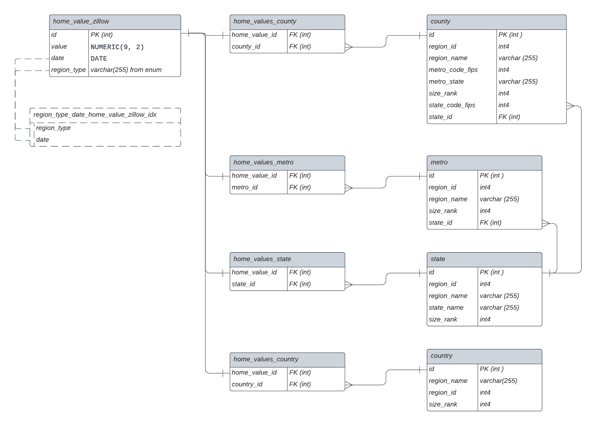
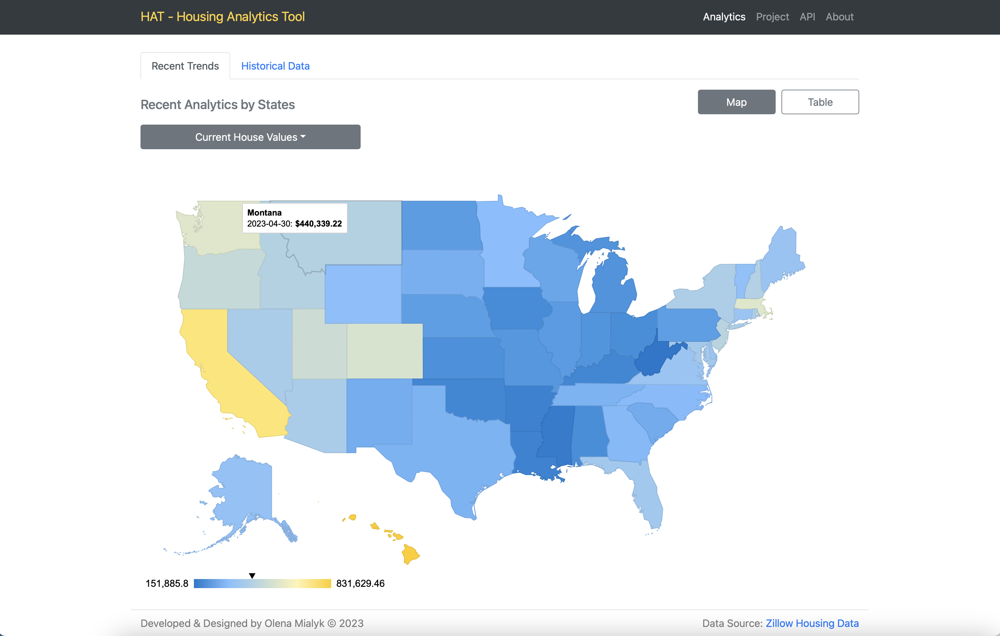
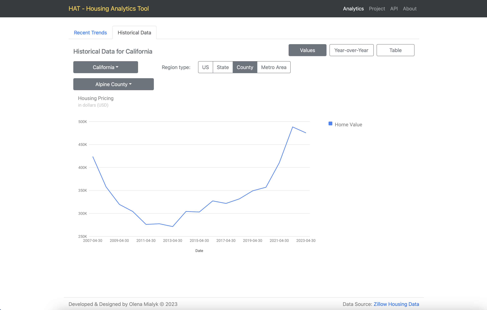
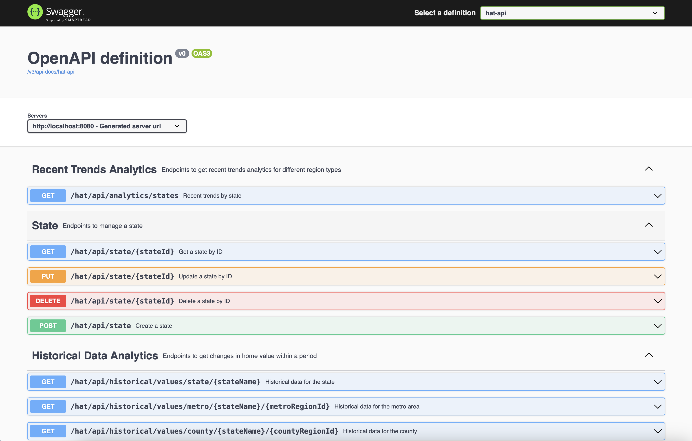

# HAT - Housing Analytics Tool

## MVP Description

The Minimum Viable Product (MVP) for the Housing Analytics Tool focuses on essential features, which include:

- A dedicated tool that efficiently retrieves and processes data from the Zillow endpoint
- Basic analytics that present the existing state of house values and the growth of house values over different periods of time
- An API that responds to user requests, delivering relevant data and allowing authorized users to create, update, and delete data
- The user interface demonstration displays current home value trends on a map and in a table view. It also shows historical trend charts and offers the ability to filter data by region type (country, state, metro, county)

## Project Description

HAT (Housing Analytics Tool) provides an API for housing statistics and analytics, crucial for understanding market health and trends.

Technical features and details:

1) The project utilizes a multi-modular, 3-tier architecture for organized development and clear separation of responsibilities
2) The application employs an automated ETL process to provide updated data and integrates the OpenCsv library for handling CSV data
3) The API supports CRUD operations and performs analytics calculations
4) Security is based on API key authentication for modification operations
5) Swagger UI is used for user-friendly API documentation, interactive exploration, and Try It Out functionality

## Project Tech Stack

- Server-Side Framework: Java, Spring Boot, JPA/Hibernate
- Build Tool: Maven
- Libraries: OpenCsv, Swagger
- Database: Postgres
- Frontend Technologies: JavaScript, HTML/CSS, jQuery, Bootstrap, GoogleCharts, Thymeleaf

## APIs Used

The HAT Application connects to the Zillow endpoint to retrieve and process housing data. Additionally, HAT provides its own analytics API and showcases its usage through a demo, utilizing the built API.

## Architecture

For the project, a N-tier architecture was implemented using multiple modules.

- The standalone application initiates an automated ETL process to provide updated data from Zillow datapoints and seeds the database
- API endpoints and documentation are presented through Swagger UI
- The demo UI, built with Thymeleaf, utilizes the HAT API to retrieve analytics and demonstrate their practical use

This design practice helps separate layers, avoids mixing data with presentation layers, and facilitates the reuse of business logic and testing functionality.

## Database Schema

For the project, which involved handling close to 1,000,000 rows in the largest table and nearly 2,000,000 rows in the entire database, efficient data management was essential.

The challenge was addressed by utilizing native queries and projections to calculate analytics on the fly based on user requests. Analytics queries were optimized, and appropriate database indexes were implemented, resulting in a significant boost in performance.

As a result, the execution time of the main queries decreased significantly from approximately 5.5 seconds to just 78 milliseconds, marking a remarkable 7000% improvement in speed.

## UI 

## API 

## Futher Improvements

CRUD functionality was added as a requirement at the end of the project, so it wasn't completely finished. Things to improve:

- Validation of incoming data
- Separation of request and response data strucrures (dtos)
- Role based API key authentification (with admin page, that allows to generate an API key) or OAuth authentification

Other features:

- Logging
- Unit tests
- Spring Batch for data processing